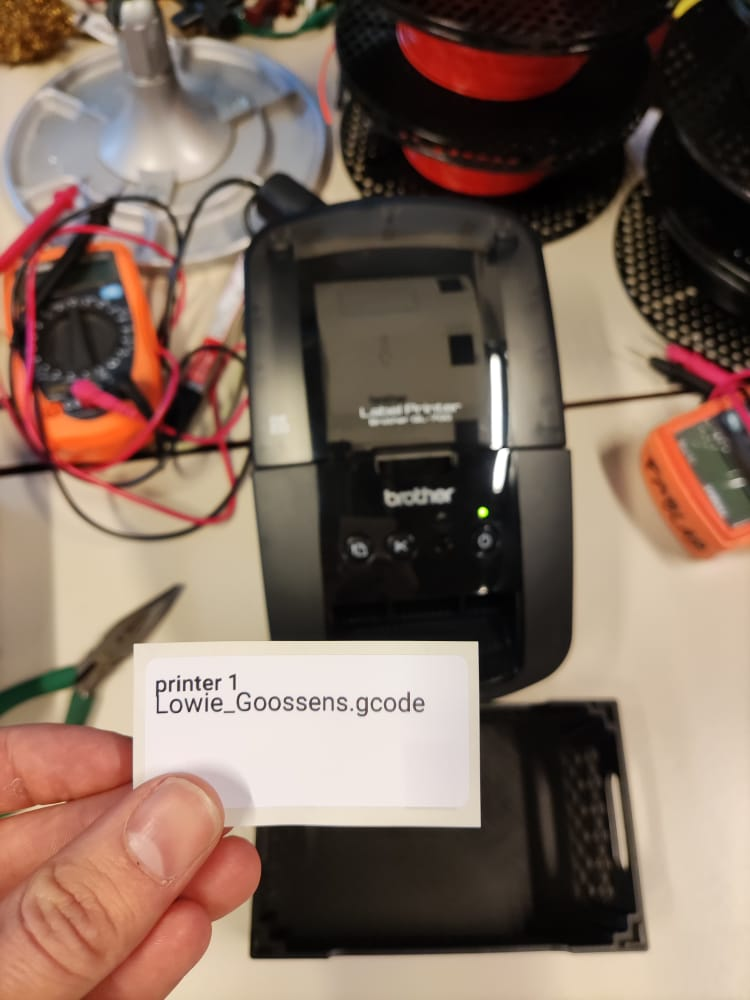
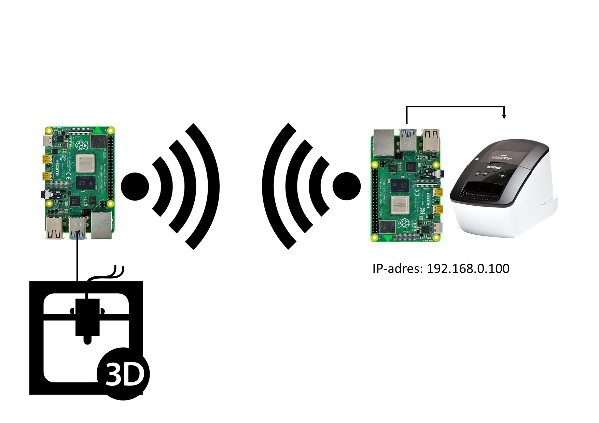
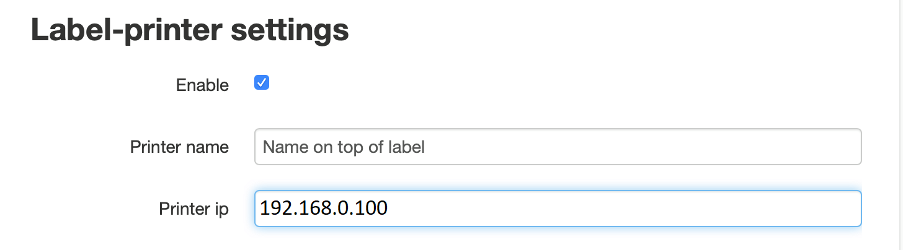
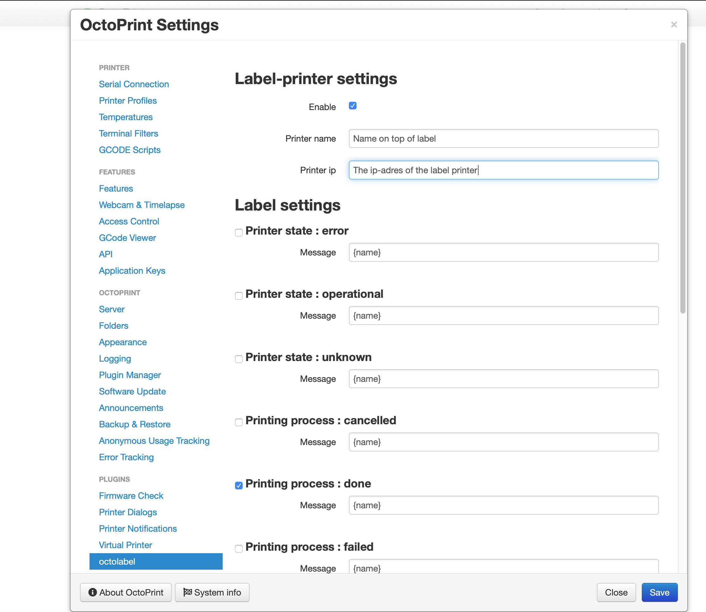
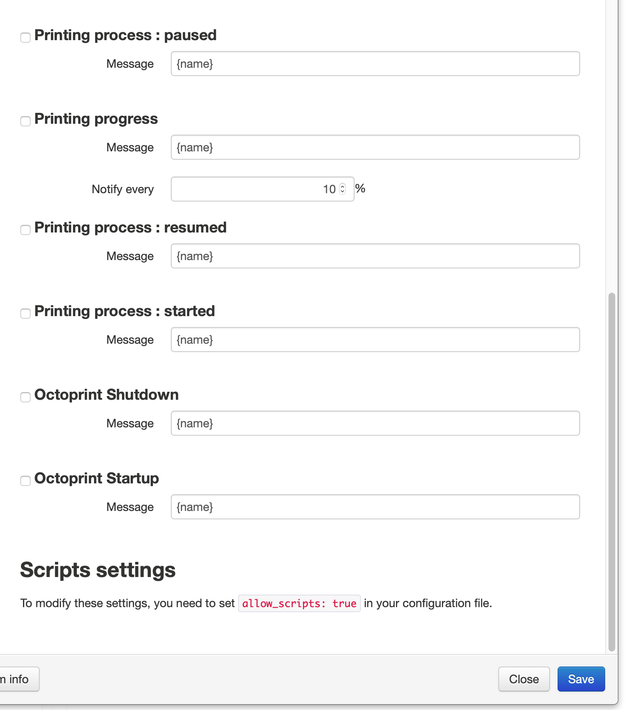
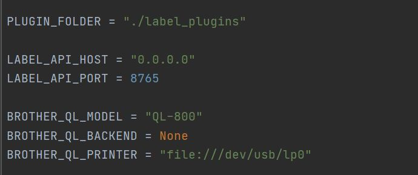
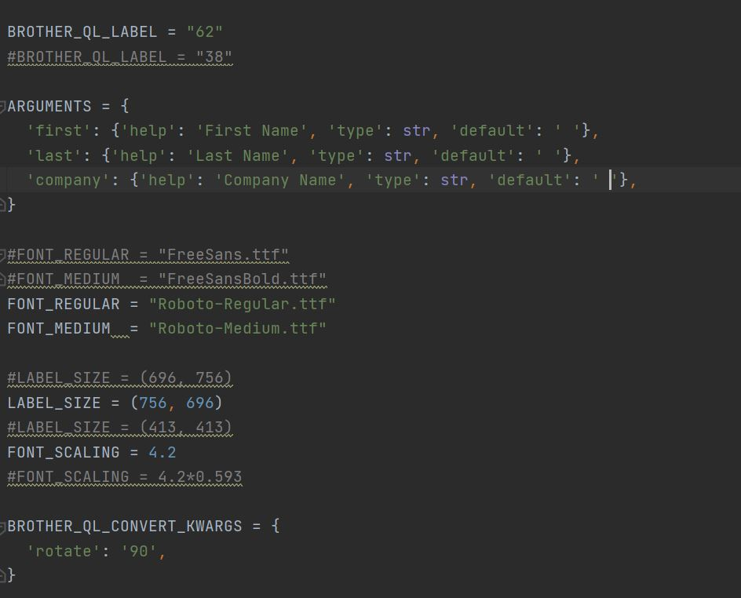

# Octoprint-OctoLabel 1.0

OctoLabel is a plugin allowing Octoprint to print labels.
This is a fork of the amazing pluggin [Octorant](https://plugins.octoprint.org/plugins/octorant/) by @bchanudet.
This is a fork of the amazing pluggin [Octotweet](https://plugins.octoprint.org/plugins/octotweet/) by @Jean Pierre GARCIA.
This is a fork of the amazing api [label_api](https://github.com/pklaus/label_api) by @Philipp Klaus.

## What is this?
This plugin makes it possible to print a label with a brother label printer each time a print is ready.
On this label stands the name of the printer so we know to witch printbed we have to go to collect a print,
And the name of the printed file so we know for who the print is.
This is a preview of a printed label:
(This is a die cut 62x29 label from brother)

## How does this work?

(Multiple Octoprint instances can send data to one single label instance)

This plugin wil only send the required data to the computer connected to the label printer. On the computer connected
to the label printer runs another api that you need to manually install. THis api is included in the label_print_api directory.
In the plugin settings you need to specify the ip-address of the computer connected to th label printer.
In this example this is: 

 
## SETUP
### Install the plugin manually
Install manually using this url :  
https://github.com/LowieGoossens/octolabel/archive/master.zip

After installing enable the plugin on the plugin manager and on the first checkbox in the settings tab.
### Install the plugin through the octoprint plugin manager
Search for Octolabel in the plugin manager and press install.
After installing enable the plugin on the plugin manager and on the first checkbox in the settings tab.

### change the label-printer settings
* Make sure the checkbox enable is checked
* Change the field Printer name (this is the name on top of the label: in my case: printer 1)
* Change the ip-address of the label printer: this is the ip-address specified in the label print api. In my case this is: 192.168.0.100
* chose when the label should be printed: check the checkbox.

### Label Settings
Here you can customize the timing of every Label handled by Octoprint.

- **Toggle the message** : by unchecking the checkbox in front of the time title, you can disable the printing the label.
- **Message** : you can change the default content here. See the section [Message format](#message-format) for more information.
- **Notify every `XX`%** : specific to the `printing progress` message, this setting allows you to change the frequency of the notification :
  - `10%` means you'll receive a message at 10%, 20%, 30%, 40% ... 80%, 90% of the printing process.
  - `5%` means you'll receive a message at 5%, 10%, 15%, 20% ... 80%, 85%, 90%, 95% of the printing process.
  - etc.

### Scripts Settings

Octotlabel allows you to launch scripts everytime a message is sent:

- Before sending: perfect for turning some LED on to ensure the webcam will always have enough light when taking the snapshot.
- After sending: perfect for turning the same LED off :smiley:.

Script configuration was deliberately made a little harder, as running scripts exposes much more the host computer. You can find more indications on the [wiki](https://github.com/bchanudet/OctoPrint-Octorant/wiki/Launching-scripts).

## Message format

Messages are regular twitter messages, which means you can use:
- `:emoji:` shortcuts to display emojis.
- `@mentions` to notify someone.

Some events also support variables, here is a basic list:

**Printing process : started event**
- `{name}`: name of the file that is being printed
- `{path}`: path of the file in its origin location
- `{origin}`: the origin storage location

**Printing process : failed event**
- `{name}`: name of the file that is being printed
- `{path}`: path of the file in its origin location
- `{origin}`: the origin storage location

**Printing process : done event**
- `{name}`: name of the file that is being printed
- `{path}`: path of the file in its origin location
- `{origin}` : the origin storage location
- `{time}`: time needed for the print (in seconds)
- `{time_formatted}` : same as `{time}`, but in a human-readable format (`HH:MM:SS`)

**Printing process : failed event**
- `{name}`: name of the file that is being printed
- `{path}`: path of the file in its origin location
- `{origin}`: the origin storage location
- `{position}`: position of the hotend

**Printing process : paused event**
- `{name}`: name of the file that is being printed
- `{path}`: path of the file in its origin location
- `{origin}`: the origin storage location
- `{position}`: position of the hotend

**Printing process : resumed event**
- `{name}`: name of the file that is being printed
- `{path}`: path of the file in its origin location
- `{origin}`: the origin storage location
- `{position}`: position of the hotend

**Printing progress event**
- `{progress}` : progress in % of the print
- `{spent}`: time spent since the start of the print (in seconds)
- `{spent_formatted}` : same as `{spent}`, but in a human-readable format (`HH:MM:SS`)
- `{remaining}`: time remaining until the end of the print (in seconds)
- `{remaining_formatted}` : same as `{remaining}`, but in a human-readable format (`HH:MM:SS`)

**Printer state : error**
- `{error}` : The error received

## about the label api
Included in the folder label print api, there you find the api writen by Philipp Klaus.
Run this api on a seperated raspberry connected to an brother label printer and modify the namebadge plugin.
It is possible to change the lettertype, textposition, de label type,...
It is important to change the ip-adres and printer settings in the file label_api. (Do not change the port)p

The following printers are claimed to be supported (✓ means verified by the author or by contributors):

QL-500 (✓), QL-550 (✓), QL-560 (✓), QL-570 (✓), QL-580N, QL-650TD, QL-700 (✓), QL-710W (✓), QL-720NW (✓), QL-800 (✓), QL-810W (✓), QL-820NWB (✓), QL-1050 (✓), and QL-1060N (✓).
The new QL-800 series can print labels with two colors (black and red) on DK-22251 labels.

Note: If your printer has an 'Editor Lite' mode, you need to disable it if you want to print via USB. Make sure that the corresponding LED is not lit by holding the button down until it turns off.

The available label names can be listed with `brother_ql info labels`:

     Name      Printable px   Description
     12         106           12mm endless
     29         306           29mm endless
     38         413           38mm endless
     50         554           50mm endless
     54         590           54mm endless
     62         696           62mm endless
     102       1164           102mm endless
     17x54      165 x  566    17mm x 54mm die-cut
     17x87      165 x  956    17mm x 87mm die-cut
     23x23      202 x  202    23mm x 23mm die-cut
     29x42      306 x  425    29mm x 42mm die-cut
     29x90      306 x  991    29mm x 90mm die-cut
     39x90      413 x  991    38mm x 90mm die-cut
     39x48      425 x  495    39mm x 48mm die-cut
     52x29      578 x  271    52mm x 29mm die-cut
     62x29      696 x  271    62mm x 29mm die-cut
     62x100     696 x 1109    62mm x 100mm die-cut
     102x51    1164 x  526    102mm x 51mm die-cut
     102x152   1164 x 1660    102mm x 153mm die-cut
     d12         94 x   94    12mm round die-cut
     d24        236 x  236    24mm round die-cut
     d58        618 x  618    58mm round die-cut

## Setup the label api
* Use the version included in the label_print_api directory on: [octotlabel label_print_api](https://github.com/LowieGoossens/octolabel/)
* Or use the latest version from [label_api](https://github.com/pklaus/label_api) by @Philipp Klaus.

(the zipped version included on my github has some minor changes)

Extract the zipped folder on the computer connected to the label printer in the directory you want to run it from.
### setup label_api
In the label_api-master directory you find the file label_api, in this file you can change some variables according to your setup.

* LABEL_API_HOST = "192.168.0.100" is the ip-address the api receives the information to print the label. 
This is the same ip-address you filled in to the octolabel plugin settings page on Octoprint.
* LABEL_API_PORT = 8765 Do not change this port, this port is specified in the plugin.
* BROTHER_QL_MODEL = "QL-800" Change this setting to your model.
* BROTHER_QL_PRINTER = "file:///dev/usb/lp0" is the usb connection to the label printer on a raspberry.
(I do not know this setting for other platforms)
  
### setup init.py

* BROTHER_QL_LABEL = "62" this is the label size you use, all possible sizes are specified in `brother_ql info labels`.
 Every label size has also a printable pixel size, save this pixel size for LABEL_SIZE.
  
* Font: if you want to change the font safe the ttf file of your font in the namebadge directory and change the name in the font settings.

* LABEL_SIZE = (756, 696) this setting is connected to BROTHER_QL_LABEL and to BROTHER_QL_CONVERT_KWARGS.
* BROTHER_QL_CONVERT_KWARGS = {  'rotate': '90', } change this to 0 if you want to rotate your text 90 degrees. 

### install and run

Install requirements:

    pip install -r requirements.txt

Run:

    ./label_api
    # for more info:
    ./label_api --help

The CLI signature of `label_api` is as follows:

    Usage: label_api [OPTIONS]
    
      Start the label_api software
    
    Options:
      --host TEXT     Host / IP to listen on
      --port INTEGER  Port to listen on
      --model TEXT    brother_ql model
      --backend TEXT  brother_ql backend
      --printer TEXT  brother_ql printer
      --debug         Enable verbose debugging output
      --help          Show this message and exit.

For more reference, you can go to the [Octoprint documentation on Events](http://docs.octoprint.org/en/master/events/index.html#sec-events-available-events).
